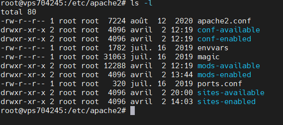

# Linux : Administration d'un serveur LAMP

Après vous avoir initié à l'administration Linux avec la formation « Installation et administration d'un serveur Linux », Rudi Bruchez vous emmène encore plus loin ! Apprenez à installer et à configurer un serveur web LAMP (Linux, Apache, MySQL et PHP), et à installer un gestionnaire de contenu comme WordPress. Vous pourrez ainsi monter votre propre serveur web sur Linux, en toute simplicité !

## Pour Installer Apache sur le Sur Debian
<code>sudo apt-get install apache2</code>

## Pour manipuler Apache
Après avoir installer apache, voici quelques commandes à connaître pour manipuler son serveur.
### Pour arrêter, demarrer, et redemarer apache
<code>
    <pre>
        sudo apachectl stop ou systemctl stop apache2.service
        sudo apachectl start ou ou systemctl start apache2.service
        sudo apachectl restart ou systemctl restart apache2.service
    </pre>
</code>

### Pour connaitre l'etat du serveur apache
<code>
    <pre>
        sudo apachectl status ou systemctl status apache2.service
    </pre>
</code>
### Pour Voir les processus qui utilisent apache
<code>
    <pre>
        top
        ps -aux | grep apache2
        ps -aux | grep apache[2]
    </pre>
</code>

### Configuration d'apache en Linux
En Linux les fichiers de configurations se trouve dans le dossier **/etc/** et plus particulièrement celui d'apache se trouve dans **/etc/apach2**
<code>
    <pre>
        cd /etc/apache2
        ls -l
    </pre>
</code>

#### Modification de httpd.conf
Pour modification **httpd.conf**, je crée et copie d'abord son contenu dans le fichier httpd.conf.save avec la commande 
<code>cv httpd.conf httpd.conf.save</code>  

### pour mieux gérer son serveur ubuntu
on va installer etckeeper et logwatch au fait etckeeper, nous permet de versionner l'etat de notre serveur ce qui nous permet de revenir à l'etat precedent à tout moment c'est à dire on pourra faire des commit vraiment c'est outil très pratique
<code>apt install etckeeper</code>

## Pour la création d'un hôte virtuel
La meilleure façon de créer un hôte virtuel basé sur le nom consiste à utiliser le conteneur d'hôte virtuel fourni à titre d'exemple dans **httpd.conf**.

L'exemple de l'hôte virtuel offert se présente de la manière suivante :

<code>
    <pre>
        1. #NameVirtualHost *:80
        2. #&lt;VirtualHost  *:80&gt;
        3. #    ServerAdmin webmaster@dummy-host.example.com
        4. #    DocumentRoot /www/docs/dummy-host.example.com
        5. #    ServerName dummy-host.example.com
        6. #    ErrorLog logs/dummy-host.example.com-error_log
        8. #    #les valeurs possible sont: debug, info, notice, warn, error, crit, alert, emerg
        9. #    LogLevel warn
        10. #   SetEnvIfRemote_Addr "127\.0\.0\.1" nolog
        11. #   CustomLog ${APACHE_LOG_DIR}/com-access_log.log combined env=!nolog
        12. #&lt;/VirtualHost&gt;
    </pre>
</code>

1. décommentez la ligne NameVirtualHost en retirant le symbole dièse (#) et en le remplaçant par le symbole(avec les version inférieur à 2.4) de l'astérisque (*) accompagné de l'adresse IP attribuée à l'ordinateur.
2. dans &lt;VirtualHost&gt;, remplacez l'astérisque (*) par l'adresse IP du serveur. Remplacez aussi ServerName par le nom d'un DNS valide assigné à l'ordinateur et configurez les autres directives selon les besoins par exemple **camaratek.com**.
3. **ServerAdmin** attribuez le mail de l'administrateur.
4. **DocumentRoot** indiquez la racine de votre site web c'est dire le dossier qui va contenir les fichiers de votre site web.
5. **ServerName** bref le nom de domaine.
6. **ErrorLog** le chemin de votre fichier log
7. **LogLevel** les niveaux d'erreur qui vont être enrégistré dans lefichier de log.
8. la ligne 10 &amp; 11 pour dire si l'adresse IP du client est 127.0.0.1 pas de log
9. Pour que tout fonctionne on doit crée les dossiers **docs** &amp; **dummy-host** s'ils n'existent pas donc on tape les commande suivantes:
    
    <code>
        <pre>
            mkdir docs
            cd docs
            mkdir dummy-host
        </pre>
    </code>

### Pour activer le site
il y a une commande **a2ensite** pour dire *appache2 enable site* qui permet d'activer le site.
<code>a2ensite dummy-host.example.com</code> puis
<code> service apache2 reload</code>

Pour allez plus loin
[Hôte virtuel sécurisé](http://httpd.apache.org/docs/2.0/ssl/ssl_intro.html)
[Création d'un hôte virtuel sur VPS 1](https://github.com/camara94/adminVPS#administrer-un-serveur-vps)
[Création d'un hôte virtuel sur VPS 2](http://web.mit.edu/rhel-doc/4/RH-DOCS/rhel-rg-fr-4/s1-apache-virtualhosts.html)

